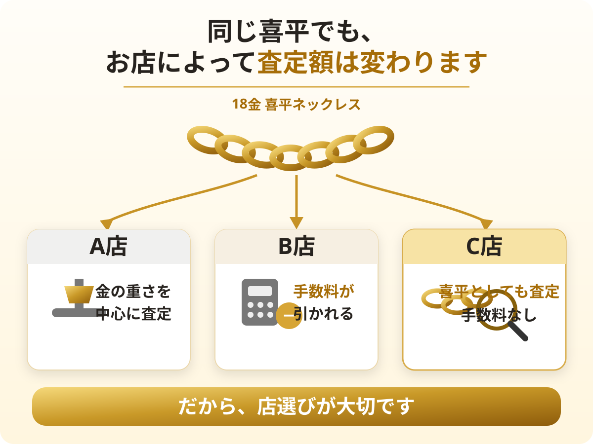
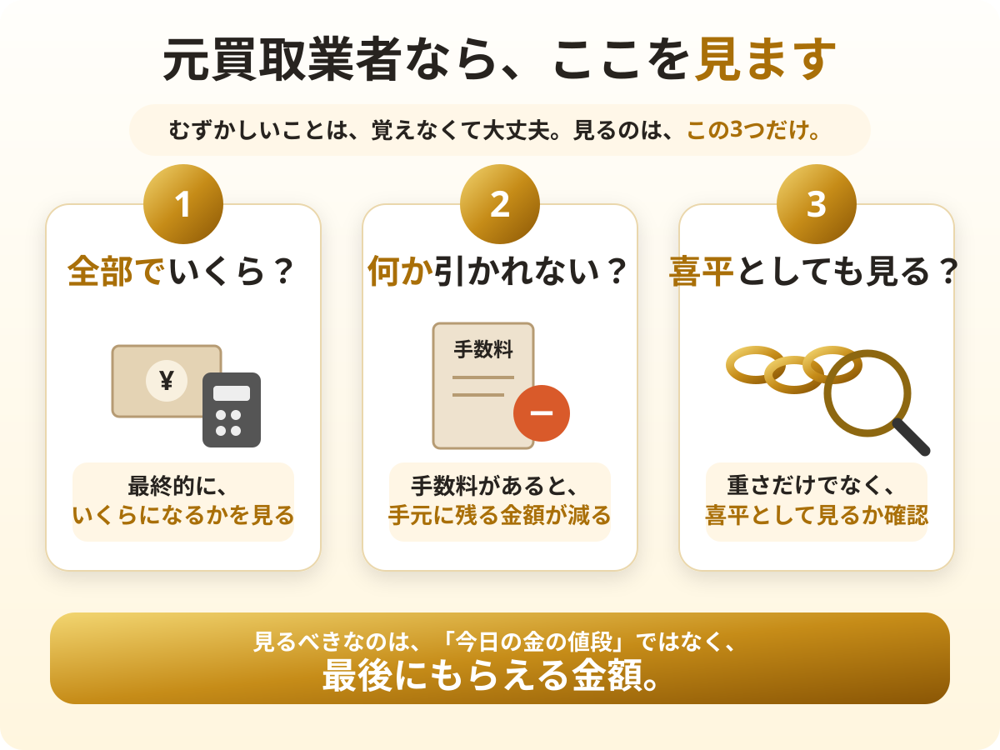
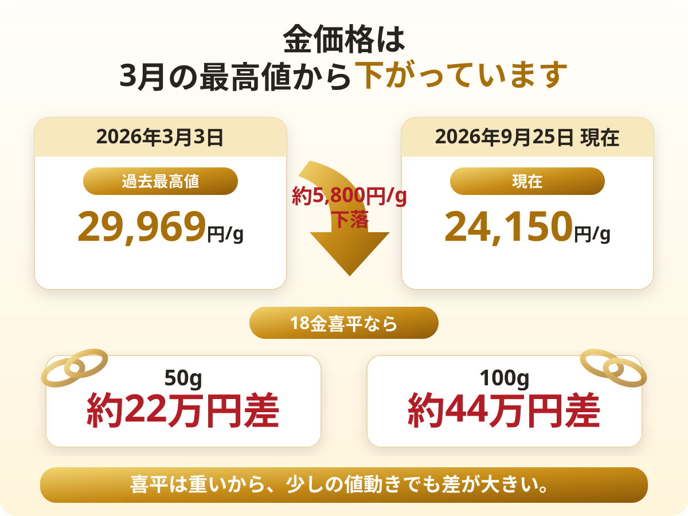
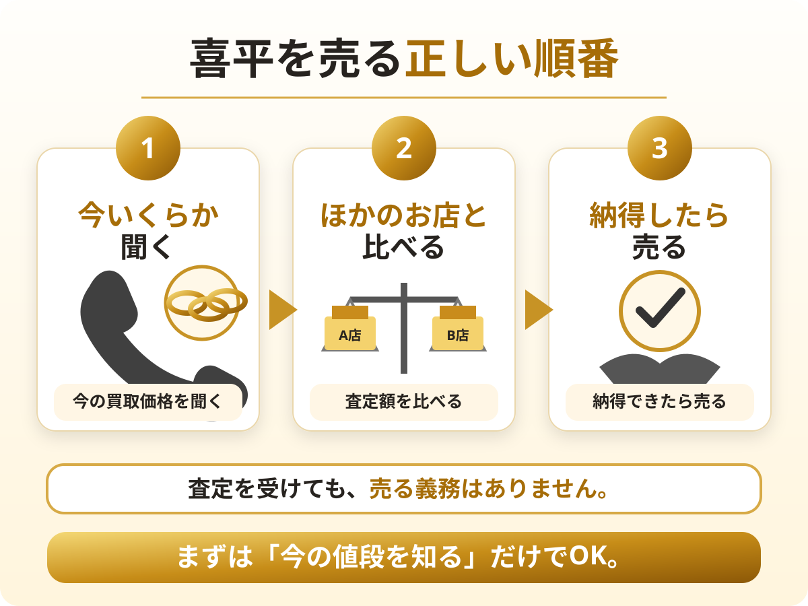
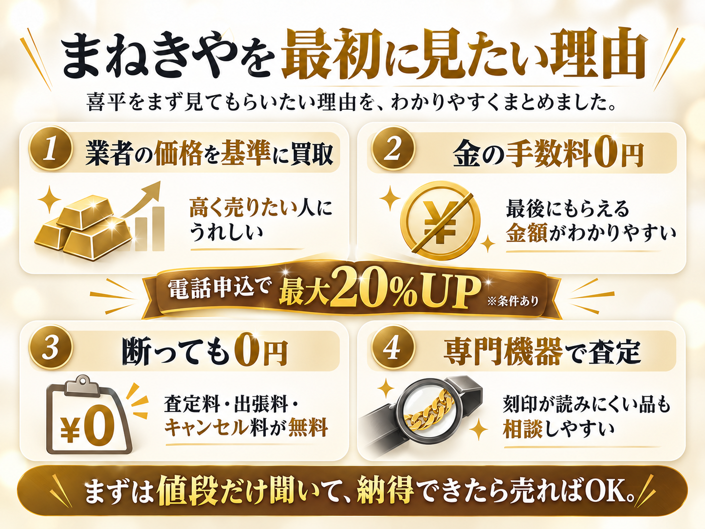

# 18金喜平LP｜画像差し込み台本

対象:
- public/k18-kihei-kaitori/index.html
- public/k18-kihei-kaitori/style.css

## 方針

LPの流れは以下で固定する。

FV
→ 喜平はいくら？
→ 喜平は店選びが重要
→ 元買取業者が見る3点
→ 3社比較表（現行のまま）
→ 今動く理由（相場下落を主役にする）
→ コンパクトな注意喚起
→ CTA
→ ランキング（現行のまま）

比較表とランキングの内容・順位・構造は変更しない。

---

## 1. 店によって査定が変わる図

画像:
`images/kihei-store-difference.svg`

配置位置:
`<h2 id="kihei-shop">ただし、喜平は「今日の金の値段」だけで店を決めないでください</h2>`
の直後。

短い導入文:
```
同じ18金。
同じ重さ。
それでも、お店によって金額が変わることがあります。
```

その直後に画像を入れる。

### 置き換えるもの

現行の
`<figure class="kh-shops">...</figure>`
は削除する。

A店・B店・C店の架空金額（約80万円、約85万円、約89万円など）も使わない。
実測データのように見えるため、画像では「査定の見方が違う」という仕組みだけを伝える。

その下の
「差が出る理由は、おもに3つです」
＋ `<ul class="ui-check">...`
も削除するか大幅に短縮する。

画像の直後は以下だけでよい。

```
大事なのは、ネットの数字ではありません。
あなたの喜平が、全部でいくらになるかです。
```

HTML例:

```html
<figure class="kihei-infographic">
  
</figure>
```

---

## 2. 元買取業者が見る3つ

画像:
`images/kihei-advisor-3points.svg`

配置位置:
`<h2 id="kihei-check">元買取業者の私なら、ここを見ます</h2>`
の直後。

### 置き換えるもの

現行の以下は画像と内容が重複するため削除する。

- `<div class="kh-advisor">...</div>`
- 「むずかしいことは、覚えなくて大丈夫です。見るのは、この3つだけ。」
- `<ol class="kh-3q">...</ol>`

画像の下には橋渡し文だけ残す。

```
同じ喜平でも、持っていく店が違えば値段が変わる。

だから、まずは買取店を比べることが大切です。
```

そのまま現行の
「では、喜平を売るならどこがいい？」
→ 3社比較表
へつなげる。

HTML例:

```html
<figure class="kihei-infographic">
  
</figure>
```

---

## 3. 3社比較表

`#compare` は現行のまま使用する。

順位・比較項目・文言・CTA・レイアウトは変更しない。

---

## 4. 相場下落の図

画像:
`images/kihei-price-drop.svg`

配置位置:
`<h2 id="why-now">【今が売り時？】喜平は、待つほど得とは限りません</h2>`
の下。

見出し直後の導入は短く残す。

```
「もう少し上がってから売ろう」
そう思って、そのままにしていませんか？
```

その直後に画像を入れる。

### 置き換えるもの

以下の文章・要素は画像と重複するため削除する。

- `gold-price-chart.webp`
- 2025年最安値14,776円/g の長い説明
- 2026年3月3日 29,969円/g の説明
- 現在24,150円/g の説明
- 最高値から約5,800円/g下落の文章
- 50g 約22万円差
- 100g 約44万円差

画像の下は以下程度に圧縮する。

```
喜平は重いぶん、金相場が少し動くだけでも金額の差が大きくなります。

この先、また上がる保証はありません。

売るか迷っているなら、今の査定額だけでも確認しておく。
これが大切です。
```

HTML例:

```html
<figure class="kihei-infographic">
  
</figure>
```

### 重要

このSVGには
「2026年9月25日」「24,150円/g」
が固定で入っている。

そのため期間限定の相場スナップショット画像として扱う。
相場更新後も長期間使う場合は、日付・現在価格を固定しない別画像へ差し替える。

---

## 5. 売る正しい順番

画像:
`images/kihei-selling-steps.svg`

配置位置:
`<h3 id="trouble">ただし、あわてて売る必要はありません</h3>`
の中。

トラブルセクションは主役にしない。
相場訴求のあとに置く「小さな安心材料」にする。

画像の前は以下だけでよい。

```
店頭で売った場合、あとからクーリング・オフはできません。

ただし、査定を受けても売る義務はありません。
```

その直後に画像。

### 削除・圧縮するもの

- 現行の長いトラブル説明
- `kin-quote kin-quote--bad`
- 「そんな相談もあります」
- 同じ意味の注意文の繰り返し
- 現行 `<p class="kh-steps">...</p>`

画像の下は以下。

```
「まだ売るか決めていない」
それでも大丈夫です。

まずは、今いくらになるのかだけ確認しましょう。
```

そのまま
キャンペーン期限
→ CTA
へつなげる。

HTML例:

```html
<figure class="kihei-infographic">
  
</figure>
```

---

## 6. まねきやを最初に見たい理由

画像:
`images/kihei-manekiya-reasons.png`

配置位置:
`<h2 id="manekiya">1位 まねきや｜迷ったら、ここ。損しないための理由</h2>`
の下。

現行の
`banner-manekiya.webp`
はそのまま残す。

バナーの直後、本文
「『まねきや』は、全国に30店舗以上ある買取の専門店です。」
の前に今回の画像を入れる。

### ランキングは変更しない

今回ユーザー方針としてランキングは現行をそのまま使用するため、
以下は削除しない。

- `ui-reco`
- 「よくあるお店と、まねきやの違い」
- おすすめな人 / 確認したいこと
- 会社スペック
- 店舗写真
- 手数料説明
- 実績
- 口コミ
- CTA

画像は「1位の理由を一目で把握するための要約」として追加する。

ただし、実装後に重複感が強ければ、
CVデータを見ながら `ui-reco` を簡略化する余地はある。

HTML例:

```html
<figure class="kihei-infographic">
  
</figure>
```

### 最適化メモ

この1枚のみ生成元PNGで保存。
本番反映時にWebP化して
`kihei-manekiya-reasons.webp`
へ差し替えるのが望ましい。

---

## 共通CSS

style.css に以下を1回だけ追加する。

```css
.kihei-infographic {
  margin: 24px auto;
  text-align: center;
}

.kihei-infographic img {
  display: block;
  width: 100%;
  height: auto;
  border-radius: 12px;
}
```

必要であればPC時のみ最大幅を設定する。

```css
@media (min-width: 768px) {
  .kihei-infographic {
    max-width: 800px;
  }
}
```

---

## 最終的な前半の流れ

1. FV
2. 「この喜平、いくら？」
3. 50g / 100gの今日の目安
4. 「今日の金の値段だけで店を決めない」
5. 画像：店によって査定が変わる
6. 「全部でいくらになるかが大事」
7. 画像：元買取業者が見る3つ
8. 「だから買取店を比較する」
9. 現行3社比較表
10. 本日の金相場
11. 「喜平は、待つほど得とは限らない」
12. 画像：最高値→現在、50g/100gの差
13. 「今の査定額だけ確認」
14. 小さな注意：「あわてて売る必要はない」
15. 画像：聞く→比べる→納得したら売る
16. キャンペーン期限
17. CTA
18. 現行ランキング
19. 1位まねきや冒頭に要約画像
20. 以降は現行のまま

## 目的

文章量を増やすための画像ではない。

50代以上のユーザーが、
文章をすべて読まなくても

- 喜平は店選びが大事
- 元買取業者は何を見るか
- 待つと数十万円変わる可能性がある
- まず査定→比較→納得して売ればよい
- なぜまねきやを見るのか

を一目で理解できるLPにする。
